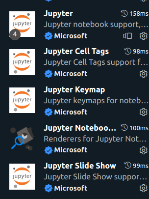
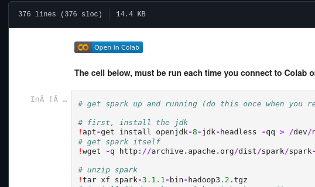

# Machine learning Workshops - Year 3
Here are all the machine learning workshops formatted into a nicer looking thing
[Notion page with lecture notes on] (https://cloud-hyacinth-ea4.notion.site/CMP3751-Machine-Learning-0b4c90426bd04251af85b19374e86675)


To install all the required libraries run this line in your terminal. If you dont have pip installed then follow this tutorial | [windows](https://www.geeksforgeeks.org/how-to-install-pip-on-windows/)|  [linux](https://www.geeksforgeeks.org/how-to-install-pip-in-linux/?ref=rp)
```bash
pip install -r requirements.txt
```
If your using VS code  *(As you should be)* you can install these extensions. These help edit and run code inside of VS code. Kinda like a Jupyter in your coding environment. **No more using your browser !**



## Installing the workshop files
To get these workshops onto your pc their are two ways of doing it.
### Method One - Google collab
GitHub has a super cool way of opening `ipynb` files.
If you click on one of the files in the repo GitHub should show you something like this.





Clicking on the google collab button should open the file in google collab. 
### Method Two - Cloning the Repo
Open your terminal in the directory you wanna use or cd into the directory.
```github
git clone https://github.com/jacobwmorgan/bigdata.git
```
Then open the directory in Vs Code.

---

If theres any issues contact me or joe on discord. Alternatively make an issue on this repo. 

- Joe [TheAverageJoe
#4923]
- Jacob [jakey#7299]
